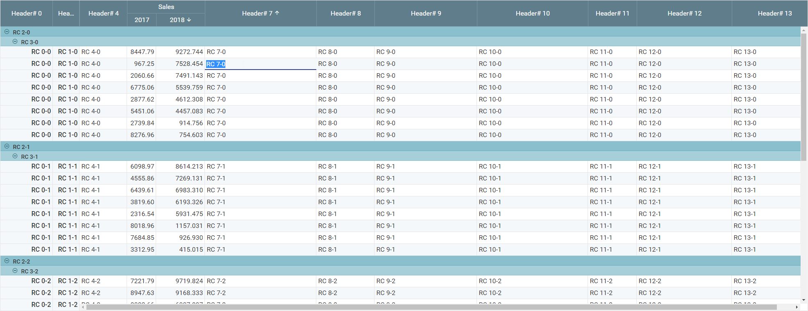

# rewire
> Makes state managment simple. 

A small core reactive component powered by JavaScript proxies and a series of libraries utilizing this core which includes: 
* Sophisticated react grid component
* Reactive graphql library with reactive cache
* UI components that wrap material-ui next to help get your project started quickly.

Status
------
This project is currently in early beta (alpha?) but we are using these libraries in-house and will become more refined and robust as our project continues.

Getting Started
---------------

```cmd
git clone https://github.com/WorkSight/rewire.git
cd rewire
yarn install
node .\fuse.js
```

A small hello world type example.
```js
import * as React            from 'react';
import * as ReactDOM         from 'react-dom';
import Observe               from 'rewire-core/Observe';
import observable, { watch } from 'rewire-core/observable';

const employee = observable({name: 'Some Guy', email: 'someone@gmail.com'});
setTimeout(() => employee.name = 'dude', 5000); // update the name property asynchronously 
watch(() => employee.name, () => console.log(employee.name)); // watch any changes to name and log them to the console.

// use plain ole react components. Observe will take a dependency on all properties accessed during render and only re-render the input when those dependencies change. 
ReactDOM.render(<div>
  <Observe render={() => <input value={employee.name} onChange={(evt) => employee.name = evt.target.value} />} />
</div>, document.getElementById('root'));
```

A screenshot of the reactive grid component



Libraries
---------
* **[rewire-core](https://github.com/WorkSight/rewire/tree/master/packages/rewire-core)**
* **[rewire-ui](https://github.com/WorkSight/rewire/tree/master/packages/rewire-ui)**
* **[rewire-grid](https://github.com/WorkSight/rewire/tree/master/packages/rewire-grid)**
* **[rewire-graphql](https://github.com/WorkSight/rewire/tree/master/packages/rewire-graphql)**

Documentation
-------------
coming soon...